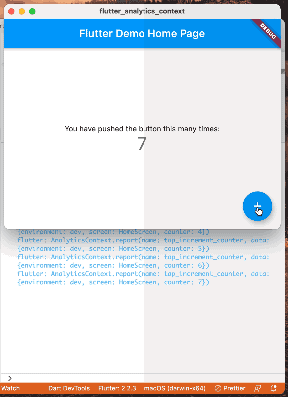

# flutter_analytics_context

A simple way to pass analytics context maps through the widget tree.

```dart
@override
Widget build(BuildContext context) {
  return AnalyticsContext(
    data: {'screen': 'HomeScreen'},
    child: Scaffold( ... ),
  );
}
```

Children merge parent maps

```dart
/// pseudocode
AnalyticsContext: {'environment': 'dev'}
  AnalyticsContext: {'my_user_id': myUserId}
    AnalyticsContext: {'screen': 'HomeScreen'}
      AnalyticsContext: {'tab': 'Following'}
        AnalyticsContext: {'user_id': userId}
          context.analyticsEvent('block_user') // a
```

Triggering A sends an event like so:

```json
{
  "name": "block_user",
  "data": {
    "environment": "dev",
    "my_user_id": "7a65e4af45ef",
    "screen": "HomeScreen",
    "tab": "Following",
    "user_id": "adf76ae7676adf"
  }
}
```


